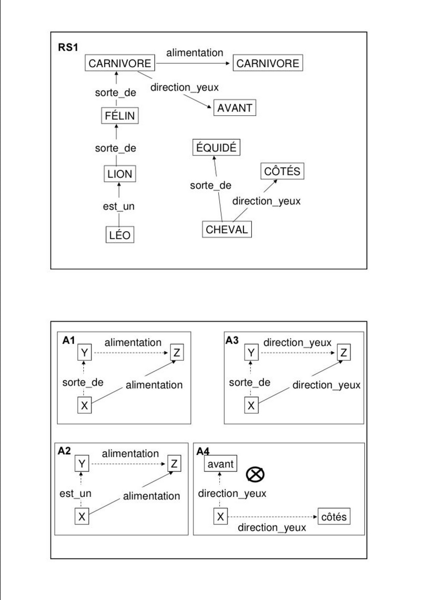
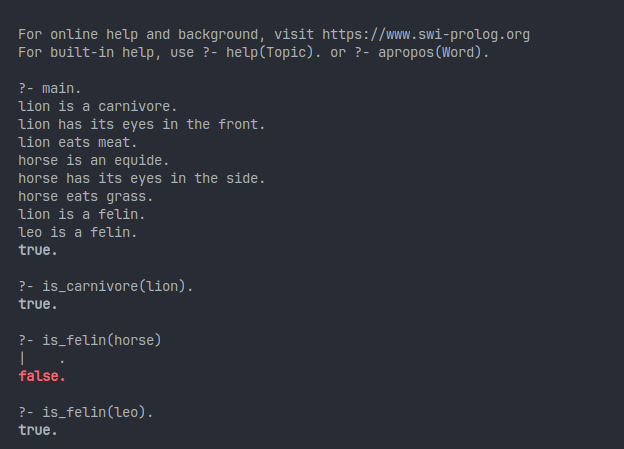

# Introduction

Cet exercice consiste à implémenter un programme Prolog qui permet de déterminer si un animal est un carnivore ou un équidé en se basant sur certaines caractéristiques. Le programme est divisé en plusieurs modules pour une meilleure organisation du code.



# Modules

Le programme est composé des modules suivants :

- **Carnivore :** Ce module contient les faits relatifs aux animaux carnivores.
- **Direction des yeux :** Ce module contient les faits relatifs à la direction des yeux des animaux.
- **Équidé :** Ce module contient les faits relatifs aux équidés.
- **Alimentation :** Ce module contient les faits relatifs à l’alimentation des animaux.
- **Felin :** Ce module contient les faits relatifs aux félins.

Chaque module contient des faits Prolog qui décrivent les caractéristiques des animaux. Par exemple, le module carnivore pourrait contenir le fait `carnivore(lion)` qui indique que le lion est un carnivore.

# Fichier principal

Le fichier principal utilise les modules pour définir des règles Prolog qui permettent de déterminer si un animal est un carnivore ou un équidé.

# Utilisation

Pour utiliser le programme, vous pouvez charger le fichier principal `main.pl` dans votre interpréteur Prolog.


Pour lancer le programme, il suffit de taper la commande `main.` dans l’interpréteur Prolog.

```
swipl -s ./main.pl
```

Puis de taper les requêtes suivantes :

```
main.
```

Qui va donner le résultat suivant :


